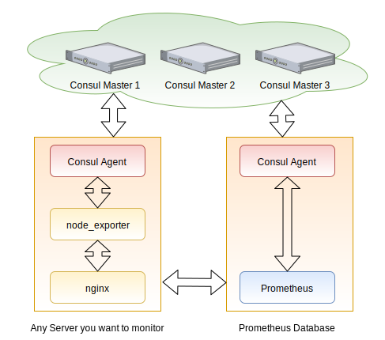

# OSMC 2019 - Deploy Prometheus exporters with Puppet at scale

## Table of contents

* [What is this about](#what-is-this-about)
* [Architecture](#architecture)
* [Notes](#notes)
* [How to get started](#how-to-get-started)
* [Vagrant cheat sheet](#vagrant-cheat-sheet)

## What is this about

This is a demo environment to show the automatic rollout of Prometheus
exporters with Puppet. A Vagrantfile is available that allows you to test and
discover all of this locally.

We will bootstrap a CentOS 7 server with:

* Puppetserver
* Consul
* node\_exporter
* Nginx as reverse TLS proxy

The second machine is a CentOS 7 client with:

* Consul
* node\_exporter

## Architecture



On the server, we setup a Consul master for service registration and service
discovery. This allows us to register each node\_exporter as a service.
Prometheus can connect to consul, get a list of services and scrape them.

To make the whole setup more secure, we wil do two things:

### Authentication and Authorisation

It's important that only trusted sources are allowed to access the exporters.
To achive this, We bind them to localhost and install an nginx in front of
them. All the exporters don't support any type of authentication or
authorisation. But nginx is able to not only handle generic TLS traffic,
it can also validate TLS client certificates. Since we already have Puppet
on each box, we can reuse the Puppet client certificates for this. Our
Prometheus daemon will connect to each exporter with a client certificate.

### Firewalling

Since firewalling needs to be scaleable, and consul demands a meshed network
between each agent. We will deploy custom iptables chains and ipsets.

## Notes

We heavily utilize the Puppet TLS certificates. To do this, we require a
Puppetserver. To make this work as easy as possible, we will use a CentOS 7
base image. CentOS 8 isn't well supported yet by most modules. To prove the
awesomenes of this setup, we will use an Archlinux (and CentOS 7 as well)
client.

Our default branch in this repository is `production`. We use r10k to deploy
puppet environment. r10k matches git branches to those environments and the
default environment name is production. Switching the default branch name from
`master` to `production` is easer then updating the puppet configuration.

### Known issues

### VM provisioning order

The clients depend on the server. If you start this project with a
`vagrant up centosclient`, it won't work properly. You need to start with the
server:

```sh
vagrant up server
```

### TLS errors

Our virtual machines don't have a proper FQDN with dots in it, only a hostname.
If your local `/etc/resolv.conf` file has a `search` set, Virtualbox will
append it to the hostname during TLS certificate creation.

The error during provisioning might look liks this:

```
    server: Warning: Unable to fetch my node definition, but the agent run will continue:
    server: Warning: Server hostname 'prometheus' did not match server certificate; expected one of prometheus.fritz.box, DNS:puppet, DNS:prometheus.fritz.box
    server: Error: /File[/opt/puppetlabs/puppet/cache/facts.d]: Failed to generate additional resources using 'eval_generate': Server hostname 'prometheus' did not match server certificate; expected one of prometheus.fritz.box, DNS:puppet, DNS:prometheus.fritz.box
```

Because of a `/etc/resolv.conf` on the host that looks like this:

```sh
# Generated by NetworkManager
search fritz.box
nameserver 192.168.178.1
nameserver fd00::e228:6dff:fe76:231c
```

Remove the `search` option and provision the virtual machines again.

Latest versions of this repository contain an sed statement during the
provisioning that will remove the mentioned `search` line.

## How to get started

So, you're interested in the Vagrant environment and want to use it. First of
you need to install virtualbox and Vagrant. A simple `vagrant status` should
look like this:

```
~/osmc2019 $ vagrant status
Current machine states:

server                    not created (virtualbox)
centosclient              not created (virtualbox)
archclient                not created (virtualbox)
ubuntuclient              not created (virtualbox)

This environment represents multiple VMs. The VMs are all listed
above with their current state. For more information about a specific
VM, run `vagrant status NAME`.
~/osmc2019 $
```

The server needs to be started first. It will provide us a Puppetserver +
Prometheus:

```sh
vagrant up server
```

Afterwards we can provision any of the clients. You can choose between CentOS,
Arch Linux or Ubuntu. You cannot start multiple instance of one machine.
Depending on the amount of memory on your box, you can two or all three
clients:

```sh
vagrant up centosclient
vagrant up archclient
vagrant up ubuntuclient
```

Vagrant wraps ssh for us. If you want to enter one machine, you can do it like
this:

```sh
vagrant ssh server
```

The Server gets a dedicated role:
https://github.com/bastelfreak/osmc2019/blob/production/modules/roles/manifests/server.pp

All clients share the same role:
https://github.com/bastelfreak/osmc2019/blob/production/modules/roles/manifests/client.pp

Exercise: What is the roles and profiles pattern?

## Vagrant cheat sheet

### Status of a Vagrant environment

```sh
vagrant status
```

### Start one / all VMs

```sh
# start all VMs from a Vagrantfile
vagrant up
```

```sh
# start a specific one
vagrant up server
```

### Sync /etc/hosts entries to all VMs

Soooooooooo, technology. Why does software suck so hard? It's a common usecase
for Virtualbox users to spawn multiple virtual machines. In most of those
situations, you want to connect from one virtual machine to another. On
Windows host systems, virtual box is smart enough and does local DNS
resolution. However, it doesn't do it on linux....

As a workaround, you can write your IP-Addresses to every `/etc/hosts` file.
This sucks. This is manual work... Thankfully, somebody wrote a Vagrant plugin
for this job
[Vagrant hostmanager plugin](https://github.com/devopsgroup-io/vagrant-hostmanager#vagrant-host-manager)

You need to install it:

```sh
vagrant plugin install vagrant-hostmanager
```

Afterwards you can add a few entries to your [Vagrantfile](./Vagrantfile):

```
config.hostmanager.enabled = true         # Update /etc/hosts with entries from other VMs
config.hostmanager.manage_host = false    # Don't update /etc/hosts on the Hypervisor
config.hostmanager.include_offline = true # Also document offline VMs
```

If you still want to update the hosts file on all running machines, do:

```sh
$ vagrant hostmanager
[vagrant-hostmanager:guest] Updating hosts file on the virtual machine server...
[vagrant-hostmanager:guest] Updating hosts file on the virtual machine centosclient...
[vagrant-hostmanager:guest] Updating hosts file on the virtual machine archclient...
```

The `/etc/hosts` file will look like this:

```
$ cat /etc/hosts
127.0.0.1 centosclient  centosclient
127.0.0.1   localhost localhost.localdomain localhost4 localhost4.localdomain4
::1         localhost localhost.localdomain localhost6 localhost6.localdomain6

## vagrant-hostmanager-start
192.168.33.10 prometheus

192.168.33.11 centosclient

192.168.33.12 archclient

## vagrant-hostmanager-end

```

The Software is smart enough to detect if the IP-Addresses are already listed
in the file. They won't be added multiple times (it's idempotent).

### Vagrant fails to start a VM

Error:

```
$ vagrant up server
Bringing machine 'server' up with 'virtualbox' provider...
==> server: Importing base box 'centos/7'...
==> server: Matching MAC address for NAT networking...
==> server: Checking if box 'centos/7' version '1905.1' is up to date...
A VirtualBox machine with the name 'server' already exists.
Please use another name or delete the machine with the existing
name, and try again.
```

Check if Vagrant knows anything about the VM:

```
$ vagrant global-status
id       name   provider   state    directory
------------------------------------------------------------------------
02c90f7  server virtualbox poweroff /home/bastelfreak/osmc2019

The above shows information about all known Vagrant environments
on this machine. This data is cached and may not be completely
up-to-date (use "vagrant global-status --prune" to prune invalid
entries). To interact with any of the machines, you can go to that
directory and run Vagrant, or you can use the ID directly with
Vagrant commands from any directory. For example:
"vagrant destroy 1a2b3c4d"
```

If so, delete the VM:

```
$ vagrant destroy 02c90f7
    server: Are you sure you want to destroy the 'server' VM? [y/N] y
==> server: Destroying VM and associated drives...
```

If that fails, virtualbox might still know it:

```
$ VBoxManage list vms
"<inaccessible>" {57d4f57d-4dda-44fc-acf9-f01826f52e5e}
"server" {0cec0d5b-6706-426f-8453-900a5ab7b91d}
```

if so, delete it within Virtualbox:

```
$ VBoxManage unregistervm 0cec0d5b-6706-426f-8453-900a5ab7b91d --delete
0%...10%...20%...30%...40%...50%...60%...70%...80%...90%...100%
```
